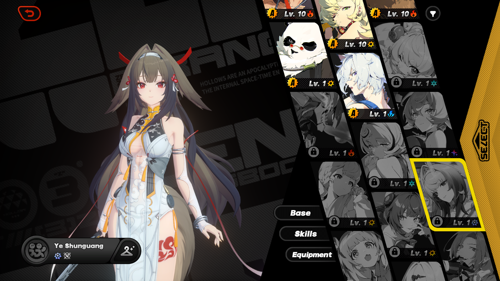
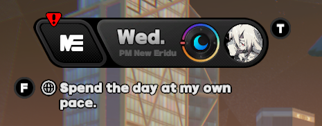
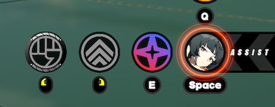

# ZZZ Mindscape Icons Mod
A python tool for generating Zenless Zone Zero agent icons based on their Mindscape artworks (or other images, if so
desired)

## Prerequisites
- Python 3.12 and the [Pillow](https://pypi.org/project/pillow/) library (`pip install Pillow`)

## Usage
- Run `main.py` to generate mod content. The project folder can then be imported into the XXMI Mods folder for use 
in-game.
  - If you only want to update a single agent, edit the `CUR_AGENT` variable in `main.py` to the desured agent's name.
  - Agent image properties and hashes can be found and configured in the `agents.json` file.
  - If you want to use a different image for an agent's skin art, you can add a new file in the `mindscapes` folder with
  the format `<Agent>Skin.png`, `<Agent>Skin2.png`, etc.

## Other Screenshots
|  |  |
|:---------------------------------------:|:--------------------------------------:|
|              **Overworld**              |            **Chain Attack**            |

|  |
|:---------------------------------------:|
|        **Agent Selection Tabs**         |