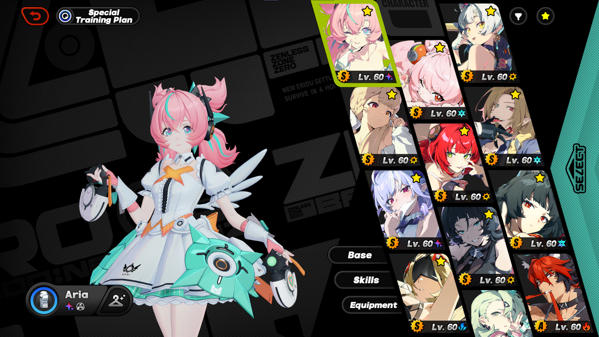
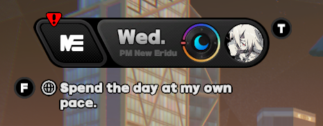
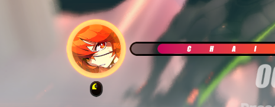

# ZZZ Mindscape Icons Mod
This mod replaces most instances of Zenless Zone Zero's agent icons with their Mindscape artworks. For the mod download,
see [releases](https://github.com/brewffee/ZZZ-Mindscape-Icons-Mod/releases).

Included in the repository is the python tool used to generate the mod content. Agent image properties and hashes can be
found and configured in the `agents.json` file, and source images can be found in the `sources` folder.

## Installation
The latest version of this mod can be found in the [releases](https://github.com/brewffee/ZZZ-Mindscape-Icons-Mod/releases) 
page.

## Screenshots
|  |  |
|:---------------------------------------:|:--------------------------------------:|
|              **Overworld**              |            **Chain Attack**            |

|  |
|:---------------------------------------:|
|        **Agent Selection Tabs**         |

## Building
### Prerequisites
- Python 3.12 and the [Pillow](https://pypi.org/project/pillow/) library (`pip install Pillow`)

### Usage
- Run `main.py` to generate mod content. The project folder can then be imported into the ZZMI Mods folder for use 
in-game.
  - If you only want to update a single agent, edit the `CUR_AGENT` constant in `main.py` to the desired agent's name.
  - If you want to use a different image for an agent's skin art, you can add a new file in the `sources` folder with
  the format `<Agent>Skin.png`, `<Agent>Skin2.png`, etc.
  - To add new toggleable icon variants, create a new directory in the `sources` folder and add it to the `SOURCE_DIRS` 
  constant in `config.py`.

## Planned Features
> [!IMPORTANT]
> While I would like to implement these soon, the resources for these screens 
> are used in many different places of the game. Replacing these resources
> would require a lot of additional work and possibly a rewrite of the 
> generator, nor could I guarantee these replacements will function
> correctly across game updates.

I plan to support additional sections in the future, including:
- [ ] Character Selection screen portraits
- [ ] Agent Trust screen icons
- [ ] Agent Display portraits
- [ ] Preset Config icons

If you have the hashes for these, please let me know by creating an [issue](https://github.com/brewffee/ZZZ-Mindscape-Icons-Mod/issues/new)!!!