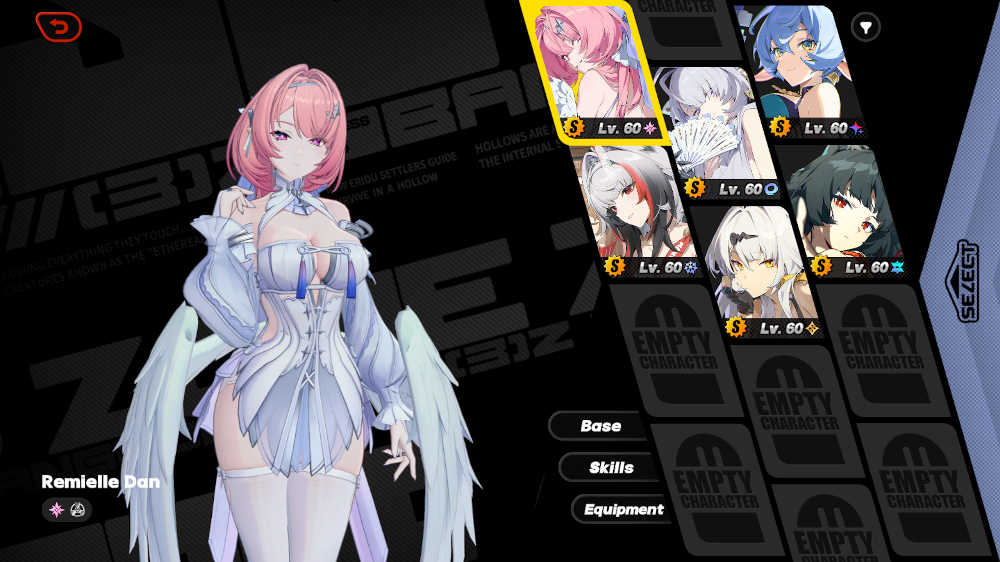
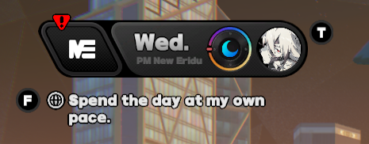
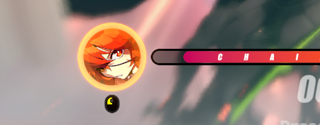

# ZZZ Mindscape Icons Mod
This mod replaces most instances of Zenless Zone Zero's agent icons with their 
Mindscape artworks. For the mod download, see 
[releases](https://github.com/brewffee/ZZZ-Mindscape-Icons-Mod/releases).

Included in the repository is the Python tool used to generate the mod content. 
Agent image properties and hashes can be found and configured in the 
`agents.json` file, and source images can be found in the `sources` folder.

## Installation
The latest version of this mod can be found in the 
[releases](https://github.com/brewffee/ZZZ-Mindscape-Icons-Mod/releases) page.

## Screenshots
|  |  |
|:---------------------------------------:|:--------------------------------------:|
|              **Overworld**              |            **Chain Attack**            |

|  |
|:---------------------------------------:|
|        **Agent Selection Tabs**         |

## Building
### Prerequisites
- Python 3.14+ and the [Pillow](https://pypi.org/project/pillow/) library 
  (`pip install Pillow`)

### Usage
- Run `main.py` to generate mod content. The project folder can then be imported 
  into ZZMI's Mods folder for use in-game.
  - To update resources for a specific agent (or group of agents), add the agent
  name(s) to the `AGENTS` list in `config.py`, and set `FILTER_EXCLUDE` to 
  `False`.
  - By default, agent skin resources will fallback to the default if the resource
  is not found. If you wish to use a different source image for an agent's skin,
  you can add a new file in the `sources` folder with the format
  `<Agent><SkinName>.png`.
